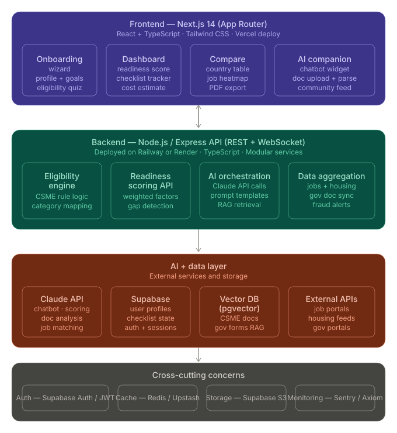

# My Caribbean Companion

A [Next.js](https://nextjs.org) 14 app (App Router, TypeScript, Tailwind) powered by Supabase and the Anthropic Claude API.

## Architecture



Three layers — a Next.js frontend, API routes that consolidate the eligibility/scoring/AI/data services, and an AI + data layer backed by Claude, Supabase (Postgres + pgvector), and external job/housing/government feeds. Auth, caching, storage, and monitoring run as cross-cutting concerns.

## Prerequisites

- Node.js 18.17+ (Next.js 14 requirement)
- npm (or yarn / pnpm / bun)
- A Supabase project (URL + anon key)
- An Anthropic API key

## 1. Install dependencies

```bash
npm install
```

## 2. Configure environment variables

Copy the example file and fill in the values:

```bash
cp .env.example .env.local
```

Then set the following in `.env.local`:

```
NEXT_PUBLIC_SUPABASE_URL=your-supabase-project-url
NEXT_PUBLIC_SUPABASE_ANON_KEY=your-supabase-anon-key
ANTHROPIC_API_KEY=your-anthropic-api-key
```

- `NEXT_PUBLIC_*` values are exposed to the browser.
- `ANTHROPIC_API_KEY` is server-only — never prefix it with `NEXT_PUBLIC_`.

## 3. Run the development server

```bash
npm run dev
```

Open [http://localhost:3000](http://localhost:3000) in your browser.

The page auto-updates as you edit files. Start with [app/page.tsx](app/page.tsx).

## Available scripts

| Command         | What it does                                   |
| --------------- | ---------------------------------------------- |
| `npm run dev`   | Start the dev server on port 3000              |
| `npm run build` | Create a production build in `.next/`          |
| `npm run start` | Run the production build (requires `build`)    |
| `npm run lint`  | Run ESLint                                     |

## Production build

```bash
npm run build
npm run start
```

## Project structure

```
my-caribbean-companion/
├── app/                          ← Next.js App Router (replaces frontend/src/pages)
│   ├── layout.tsx                ← global layout, nav, auth provider
│   ├── page.tsx                  ← home / landing page
│   ├── (auth)/
│   │   ├── login/page.tsx
│   │   └── signup/page.tsx
│   ├── onboarding/page.tsx       ← wizard (replaces Plan My Move)
│   ├── dashboard/page.tsx        ← readiness score, checklist, cost estimate
│   ├── compare/page.tsx          ← country comparison dashboard
│   ├── companion/page.tsx        ← AI chatbot interface
│   ├── resources/page.tsx        ← document hub
│   ├── community/page.tsx        ← peer stories (Phase 2)
│   └── api/                      ← replaces the Express backend
│       ├── eligibility/route.ts  ← GET /api/eligibility?from=&to=&category=
│       ├── plan/route.ts         ← POST /api/plan (generates full plan)
│       ├── score/route.ts        ← POST /api/score (readiness scoring)
│       ├── chat/route.ts         ← POST /api/chat (Claude API)
│       ├── countries/route.ts    ← GET /api/countries
│       └── categories/route.ts   ← GET /api/categories
│
├── components/                   ← shared React components
│   ├── wizard/                   ← onboarding wizard steps
│   ├── dashboard/                ← score card, checklist, cost widget
│   ├── compare/                  ← country table, charts
│   └── ui/                       ← shadcn/ui base components
│
├── lib/                          ← business logic (replaces backend/routes)
│   ├── eligibility.ts            ← CSME rules logic, TypeScript-ified
│   ├── scoring.ts                ← readiness score engine
│   ├── claude.ts                 ← Claude API client wrapper
│   └── supabase.ts               ← Supabase client
│
├── data/                         ← static JSON data
│   ├── countries.json
│   ├── categories.json
│   └── csme-rules.json
│
└── supabase/
    └── migrations/               ← database schema files
```

Quick links:

- [app/](app/) — routes, layouts, and server components (App Router)
- [components/](components/) — reusable React components
- [lib/](lib/) — Supabase and Anthropic clients, shared utilities
- [data/](data/) — static data
- [tailwind.config.ts](tailwind.config.ts) — Tailwind configuration

## Troubleshooting

- **`Error: Missing Supabase env vars`** — confirm `.env.local` exists and the dev server was restarted after edits.
- **Anthropic 401** — verify `ANTHROPIC_API_KEY` is set and the dev server was restarted.
- **Port 3000 in use** — run `npm run dev -- -p 3001` to pick another port.
